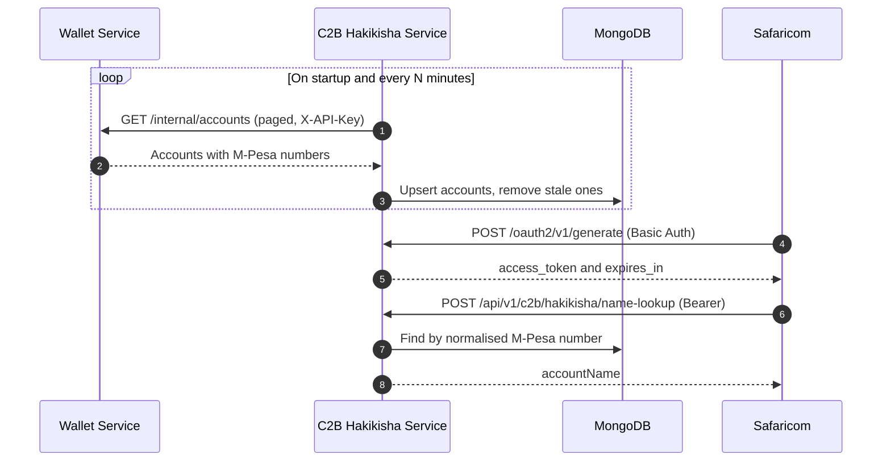

<p align="center">
  
</p>

<h1 align="center">C2B Hakikisha API: M-Pesa Name Lookup Microservice</h1>

<p align="center">
  <b>A production-minded Spring Boot 4 &amp; MongoDB implementation of Safaricom's <i>C2B Hakikisha</i> (account name validation) API, keyed on the customer's M-Pesa phone number.</b>
</p>

<p align="center">
  <a href="https://github.com/peacemakerbill">
    
  </a>
  <br/>
  <sub>Built by <a href="https://github.com/peacemakerbill"><b>Bill Graham Peacemaker</b></a> (<code>@peacemakerbill</code>) · Full-Stack Software Engineer · API Integration Specialist · Nairobi, Kenya</sub>
</p>

<p align="center">
  
  
  
  
  
</p>

<p align="center">
  <a href="https://github.com/peacemakerbill/premisave-c2b-hakikisha-service-m-pesa/stargazers"></a>
  <a href="https://github.com/peacemakerbill/premisave-c2b-hakikisha-service-m-pesa/network/members"></a>
  <a href="https://github.com/peacemakerbill/premisave-c2b-hakikisha-service-m-pesa/issues"></a>
  <a href="https://github.com/peacemakerbill/premisave-c2b-hakikisha-service-m-pesa/commits"></a>
  
  
  
</p>

<p align="center">
  <a href="#quick-start">Quick start</a> ·
  <a href="#how-the-safaricom-c2b-hakikisha-flow-works">How it works</a> ·
  <a href="#api-reference">API reference</a> ·
  <a href="#configuration-reference">Configuration</a> ·
  <a href="#troubleshooting">Troubleshooting</a>
</p>

> ⭐ **If this saves you time integrating M-Pesa C2B Hakikisha, please star the repo.** It helps other Kenyan fintech developers find it.

> **Disclaimer.** This is an independent, community-built project. It is **not** an official Safaricom product and is not affiliated with or endorsed by Safaricom PLC. M-PESA is a trademark of Safaricom. Always follow Safaricom's own C2B Hakikisha documentation for onboarding and go-live requirements.

---

## Table of contents

1. [What is this?](#what-is-this)
2. [Features](#features)
3. [Architecture](#architecture)
4. [How the Safaricom C2B Hakikisha flow works](#how-the-safaricom-c2b-hakikisha-flow-works)
5. [Quick start](#quick-start)
6. [Build and run](#build-and-run)
7. [Configuration reference](#configuration-reference)
8. [API reference](#api-reference)
9. [Testing with Postman or curl](#testing-with-postman-or-curl)
10. [Wallet sync job](#wallet-sync-job)
11. [Data model and phone number matching](#data-model-and-phone-number-matching)
12. [Compliance with the Safaricom documentation](#compliance-with-the-safaricom-documentation)
13. [Going live](#going-live)
14. [Security notes](#security-notes)
15. [Project structure](#project-structure)
16. [Troubleshooting](#troubleshooting)
17. [Roadmap ideas](#roadmap-ideas)
18. [Contributing](#contributing)
19. [Author](#author)

---

## What is this?

**C2B Hakikisha** ("hakikisha" is Swahili for *verify* or *make sure*) is a Safaricom M-Pesa API that lets a paybill owner confirm an account with Safaricom **before** a customer pays. Safaricom calls **your** service with an account number, and your service answers with the **account name**, so the payer can see who they are about to pay.

This microservice is the **provider side** of that API. It:

- exposes the two endpoints Safaricom calls (an **OAuth-style token endpoint** and the **name lookup endpoint**),
- answers lookups from a local **MongoDB** copy of your accounts, so responses are fast and independent of upstream availability,
- keeps that copy fresh with a **scheduled sync** from your wallet service (on startup and every 5 minutes by default, configurable),
- uses the customer's **M-Pesa phone number as the account number**, which is the natural identifier for M-Pesa-based services.

It was built for the [Premisave](https://github.com/peacemakerbill?tab=repositories) platform, but the sync source is a single, isolated client class, so adapting it to another account store is straightforward.

## Features

| | |
|---|---|
| **Safaricom-spec endpoints** | Token endpoint (Basic Auth to Bearer token) and name lookup, using the documented request/response shapes and HTTP status codes (200, 400, 422, 500). |
| **Phone number as account number** | `2547XXXXXXXX`, `+2547XXXXXXXX`, `07XXXXXXXX`, `01XXXXXXXX` and bare 9-digit forms all resolve to the same account. |
| **Fast local lookups** | Indexed MongoDB collection; no upstream call on the hot path. |
| **Account listing** | `GET /internal/accounts` pages through everything saved, using the same Bearer token as the name lookup. |
| **Self-healing sync** | Runs on startup and on a fixed delay you control. A failed run never deletes data and never stops the scheduler. |
| **Safe by default** | Frozen accounts, unknown numbers, nameless accounts and ambiguous (shared) numbers are all reported as *Invalid account number*. |
| **Readable operations** | One-line, human-friendly log messages for "wallet offline", "wrong API key", "bad credentials" and recovery. |
| **12-factor config** | Everything in `application.yml`, driven by environment variables or a git-ignored `.env`. |
| **Fail-fast startup** | Missing credentials or shortcode stop the app at boot instead of failing at 2 a.m. |
| **Constant-time credential checks** | Credential comparison does not leak timing information. |

## Architecture



**Design choices**

- **Lookups never call the wallet service.** A wallet outage cannot break a customer payment screen.
- **Sync is additive and guarded.** Stale records are only removed after a *fully successful* run that returned at least one account.
- **Opaque, short-lived tokens** are issued in memory (see [Security notes](#security-notes) for the multi-instance caveat).

## How the Safaricom C2B Hakikisha flow works

This section follows Safaricom's *C2B Hakikisha API Documentation* (document version 1.0, 15 Oct 2024). In this flow **you are the API provider** and Safaricom is the client. You give Safaricom your URLs and credentials, and Safaricom calls you.

### Step 1: Authentication (access token)

Safaricom sends a `POST` with **Basic Auth** (`username:password`, Base64-encoded) to your token URL.

```http
POST /oauth2/v1/generate?grant_type=client_credentials
Authorization: Basic <Base64(username:password)>
```

Success (`200`):

```json
{
  "access_token": "zoBcDCyxe4Isbvk6ZECr8MYfv79L",
  "expires_in": "3599"
}
```

Failure (`401`):

```json
{
  "errorCode": "401",
  "errorMessage": "Client credentials are invalid"
}
```

### Step 2: Authenticated API call (account name lookup)

For every later request Safaricom sends the token as `Authorization: Bearer <access_token>`.

Request body:

| Field | Type | Description |
|---|---|---|
| `requestId` | string | Unique identifier for the request, typically a UUID. Echoed back. |
| `timestamp` | string | UNIX timestamp or ISO 8601. Echoed back. |
| `accountNumber` | string | **Here: the customer's M-Pesa phone number.** |
| `shortcode` | string / integer | Your organisation's paybill shortcode. |

Success response (`200 OK`):

| Field | Type | Description |
|---|---|---|
| `requestId` | string | Matches the request. |
| `timestamp` | string | Matches the request. |
| `accountNumber` | string | The account number as received. |
| `shortcode` | string | Your paybill shortcode. |
| `accountName` | string | The name registered against the account. |

### Error responses

| Situation | HTTP status | `errorMessage` |
|---|---|---|
| Unknown, frozen, nameless or ambiguous account, or not a valid phone number | `400 Bad Request` | `Invalid account number` |
| Shortcode does not match this service | `400 Bad Request` | `Invalid shortcode` |
| `accountNumber` or `shortcode` missing, or malformed JSON body | `422 Unprocessable Content` | `Missing required fields` |
| Unexpected server-side failure (for example the database is down) | `500 Internal Server Error` | `Internal server error` |

All lookup errors have the shape `{ "requestId": "...", "errorMessage": "..." }`.

## Quick start

### Prerequisites

- **Java 21**
- **Maven 3.9+** (or the Maven wrapper, if your checkout includes `mvnw`)
- **MongoDB** running locally, in Docker or on Atlas
- Your **wallet service** running (only needed for the sync; the app itself starts without it)

```bash
# 1. Clone
git clone https://github.com/peacemakerbill/premisave-c2b-hakikisha-service-m-pesa.git
cd premisave-c2b-hakikisha-service-m-pesa

# 2. Start MongoDB (skip if you already have one)
docker run -d --name c2b-mongo -p 27017:27017 mongo:8

# 3. Create your .env (see the next section), then run
mvn spring-boot:run
```

Create a `.env` file next to `pom.xml`:

```properties
SERVER_PORT=8090
MONGODB_URI=mongodb://localhost:27017/premisave-c2b-hakikisha

# Wallet service that owns the accounts
WALLET_SERVICE_URL=http://localhost:8084
INTERNAL_API_KEY=<same value as the wallet service's INTERNAL_API_KEY>

# What Safaricom will use against the token endpoint
HAKIKISHA_SHORTCODE=600992
HAKIKISHA_USERNAME=<choose a username>
HAKIKISHA_PASSWORD=<choose a strong password>
```

> **Important:** write `.env` values **without quotes and without trailing spaces**. The file is read as a Java properties file, so `HAKIKISHA_PASSWORD="secret"` would include the quote characters in the password. Avoid backslashes in passwords too.

When the service is healthy you will see lines like:

```
Tomcat started on port 8090 (http) with context path '/'
Starting wallet sync (startup)
Wallet sync complete: 42 accounts upserted, 0 stale removed, 1 page(s)
```

## Build and run

```bash
# Compile and package an executable jar
mvn clean package

# Run it (environment variables or a .env in the working directory)
java -jar target/premisave-c2b-hakikisha-service-m-pesa-0.0.1-SNAPSHOT.jar
```

**Notes**

- The project uses a Spring Boot **snapshot** parent, so the first build needs network access to `https://repo.spring.io/snapshot` (already declared in `pom.xml`). Pin to a release version once Spring Boot 4.2.0 is generally available.
- `.env` is loaded from the **working directory** through `spring.config.import`. Real environment variables (Docker, Kubernetes, systemd) also work and take precedence over `.env`.
- Running from **Spring Tools / Eclipse (STS)**? See [Troubleshooting](#troubleshooting) for the m2e "session scope" marker.

## Configuration reference

Every setting lives in `src/main/resources/application.yml` and can be overridden by an environment variable or `.env`.

| Environment variable | Default | Required | Description |
|---|---|---|---|
| `SERVER_PORT` | `8090` | no | HTTP port. |
| `MONGODB_URI` | `mongodb://localhost:27017/premisave-c2b-hakikisha` | no | MongoDB connection string. |
| `WALLET_SERVICE_URL` | `http://localhost:8084` | no | Base URL of the wallet service. |
| `INTERNAL_API_KEY` | none | **yes** | Sent as `X-API-Key` to the wallet service's `/internal/**` endpoints. Used only inside the service by the sync job; callers of this service never send it. |
| `HAKIKISHA_SHORTCODE` | `600992` | no | Paybill shortcode. Requests with any other shortcode are rejected. |
| `HAKIKISHA_USERNAME` | none | **yes** | Basic Auth username Safaricom uses on the token endpoint. |
| `HAKIKISHA_PASSWORD` | none | **yes** | Basic Auth password Safaricom uses on the token endpoint. |
| `HAKIKISHA_TOKEN_TTL_SECONDS` | `3599` | no | Lifetime of an issued access token (`expires_in`). |
| `HAKIKISHA_SYNC_ENABLED` | `true` | no | Turn the wallet sync job on or off. |
| `HAKIKISHA_SYNC_INTERVAL_MINUTES` | `5` | no | Delay between sync runs, measured from the end of the previous run. |
| `HAKIKISHA_SYNC_RUN_ON_STARTUP` | `true` | no | Also run one sync as soon as the app has started. |
| `HAKIKISHA_SYNC_PAGE_SIZE` | `100` | no | Page size requested from the wallet service. |
| `HAKIKISHA_SYNC_DELETE_STALE` | `true` | no | Remove accounts the wallet service no longer returns (after a fully successful run). |
| `HAKIKISHA_SYNC_CONNECT_TIMEOUT_SECONDS` | `10` | no | Connect timeout for wallet calls. |
| `HAKIKISHA_SYNC_READ_TIMEOUT_SECONDS` | `30` | no | Read timeout for wallet calls. |

The service **refuses to start** if `INTERNAL_API_KEY`, `HAKIKISHA_USERNAME` or `HAKIKISHA_PASSWORD` is missing, by design.

## API reference

Base URL (local): `http://localhost:8090`

### `POST /oauth2/v1/generate`: get an access token

| | |
|---|---|
| **Query** | `grant_type=client_credentials` |
| **Header** | `Authorization: Basic <Base64(username:password)>` |
| **Body** | none |

| Status | Body |
|---|---|
| `200` | `{"access_token":"...","expires_in":"3599"}` |
| `401` | `{"errorCode":"401","errorMessage":"Client credentials are invalid"}` |
| `400` | `{"errorCode":"400","errorMessage":"grant_type must be client_credentials"}` |

### `POST /api/v1/c2b/hakikisha/name-lookup`: look up an account name

| | |
|---|---|
| **Header** | `Authorization: Bearer <access_token>` |
| **Header** | `Content-Type: application/json` |

Request:

```json
{
  "requestId": "dcd1c2ab-7a26-4170-939d-9dc2e879b0e5",
  "timestamp": "1728897681",
  "accountNumber": "254712345678",
  "shortcode": "600992"
}
```

Response (`200`):

```json
{
  "requestId": "dcd1c2ab-7a26-4170-939d-9dc2e879b0e5",
  "timestamp": "1728897681",
  "accountName": "Jane Wanjiru Mwangi",
  "accountNumber": "254712345678",
  "shortcode": "600992"
}
```

Other outcomes:

| Status | Body |
|---|---|
| `400` | `{"requestId":"...","errorMessage":"Invalid account number"}` or `"Invalid shortcode"` |
| `422` | `{"requestId":"...","errorMessage":"Missing required fields"}` |
| `401` (bad or missing token) | `{"errorCode":"401","errorMessage":"Missing or invalid access token"}` or `"Invalid or expired access token"` |
| `500` | `{"requestId":"...","errorMessage":"Internal server error"}` |

### `GET /internal/accounts`: list saved accounts

Lists everything the wallet sync has saved in MongoDB. Handy for checking that a sync worked and for finding out *why* a phone number returns "Invalid account number".

| | |
|---|---|
| **Header** | `Authorization: Bearer <access_token>` (from the token endpoint) |
| **Header** | `Content-Type: application/json` |
| **Query** | `page` (default `0`), `size` (default `20`, max `200`), `frozen` (optional: `true` or `false`) |

Response (`200`), in the same envelope as the wallet service:

```json
{
  "success": true,
  "message": "Saved accounts retrieved",
  "data": {
    "content": [
      {
        "userId": "…",
        "accountNumber": "user@example.com",
        "fullName": "Jane Wanjiru Mwangi",
        "frozen": false,
        "mpesaPhoneNumber": "254712345678",
        "mpesaPhoneKey": "254712345678",
        "pochiPhoneNumber": null,
        "paypalEmail": null,
        "paypalConnectedEmail": null,
        "stripeConnected": false,
        "stripePayoutsEnabled": false,
        "flutterwavePaymentMethodNetwork": null,
        "flutterwavePaymentMethodPhone": null,
        "createdAt": "2026-08-29T01:49:29.921",
        "lastSyncedAt": "2026-09-21T10:15:00Z"
      }
    ],
    "page": { "size": 20, "number": 0, "totalElements": 1, "totalPages": 1 }
  },
  "timestamp": "2026-09-21T10:15:42.123"
}
```

| Status | Body |
|---|---|
| `200` | The envelope above. Results are sorted by account id, so paging is stable. |
| `401` | `{"errorCode":"401","errorMessage":"Missing or invalid access token"}` or `"Invalid or expired access token"` |

This endpoint returns personal data (names, phone numbers, e-mails) and accepts the same Bearer token as the name lookup, so anyone holding a valid token can read it. Limit who receives the Basic Auth credentials and keep the service behind TLS.

## Testing with Postman or curl

### curl

```bash
BASE=http://localhost:8090

# 1. Get a token
TOKEN=$(curl -s -X POST "$BASE/oauth2/v1/generate?grant_type=client_credentials" \
  -u "$HAKIKISHA_USERNAME:$HAKIKISHA_PASSWORD" | sed -E 's/.*"access_token":"([^"]+)".*/\1/')

# 2. Look up a name (use a phone number that exists in your wallet service)
curl -s -X POST "$BASE/api/v1/c2b/hakikisha/name-lookup" \
  -H "Authorization: Bearer $TOKEN" \
  -H "Content-Type: application/json" \
  -d '{"requestId":"dcd1c2ab-7a26-4170-939d-9dc2e879b0e5","timestamp":"1728897681","accountNumber":"254712345678","shortcode":"600992"}'
```

### Postman

Create a folder named **`c2b-hakikisha-service`** in your collection.

**Collection variables**

| Variable | Value |
|---|---|
| `base_url_c2b_hakikisha` | `http://localhost:8090` |
| `hakikisha_username` | your `HAKIKISHA_USERNAME` |
| `hakikisha_password` | your `HAKIKISHA_PASSWORD` |
| `hakikisha_shortcode` | `600992` |
| `hakikisha_account_number` | a phone number that exists in your wallet data, for example `254712345678` |
| `hakikisha_access_token` | leave blank, the token request fills it in |

**Request 1: Get Access Token**

- `POST {{base_url_c2b_hakikisha}}/oauth2/v1/generate?grant_type=client_credentials`
- Authorization tab: **Basic Auth**, username `{{hakikisha_username}}`, password `{{hakikisha_password}}`
- Tests tab:

```javascript
pm.test("200 OK", () => pm.response.to.have.status(200));
pm.collectionVariables.set("hakikisha_access_token", pm.response.json().access_token);
```

**Request 2: Name Lookup**

- `POST {{base_url_c2b_hakikisha}}/api/v1/c2b/hakikisha/name-lookup`
- Headers: `Authorization: Bearer {{hakikisha_access_token}}`, `Content-Type: application/json`
- Body (raw, JSON):

```json
{
  "requestId": "{{$guid}}",
  "timestamp": "{{$timestamp}}",
  "accountNumber": "{{hakikisha_account_number}}",
  "shortcode": "{{hakikisha_shortcode}}"
}
```

**Request 3: List Saved Accounts**

- `GET {{base_url_c2b_hakikisha}}/internal/accounts?page=0&size=20`
- Headers: `Authorization: Bearer {{hakikisha_access_token}}`, `Content-Type: application/json`
- Optional query: `frozen=true` or `frozen=false`

**Error-case requests worth saving**

| Name | Change | Expected |
|---|---|---|
| Invalid Account | unknown phone number | `400` Invalid account number |
| Frozen Account | phone of a frozen wallet account | `400` Invalid account number |
| Wrong Shortcode | `shortcode` = `111111` | `400` Invalid shortcode |
| Missing Fields | remove `accountNumber` | `422` Missing required fields |
| No Token | remove the `Authorization` header | `401` Missing or invalid access token |
| Bad Credentials | wrong Basic Auth password | `401` Client credentials are invalid |

## Wallet sync job

The lookup table is filled by a scheduled job, `WalletSyncScheduler` and `WalletSyncService`.

1. On startup (if `HAKIKISHA_SYNC_RUN_ON_STARTUP=true`) and then every `HAKIKISHA_SYNC_INTERVAL_MINUTES`, it calls `GET {WALLET_SERVICE_URL}/internal/accounts?page=N&size=M` with the `X-API-Key` header.
2. It walks **every page** (using `totalPages` from the response) and upserts each account into the `wallet_accounts` collection.
3. After a **fully successful** run that returned at least one account, accounts not seen in that run are removed (`HAKIKISHA_SYNC_DELETE_STALE`).
4. Overlapping runs are skipped.

The expected wallet response shape:

```json
{
  "success": true,
  "message": "Account details retrieved",
  "data": {
    "content": [
      {
        "userId": "…",
        "accountNumber": "user@example.com",
        "fullName": "Jane Wanjiru Mwangi",
        "frozen": false,
        "mpesaPhoneNumber": "254712345678",
        "pochiPhoneNumber": null,
        "paypalEmail": null
      }
    ],
    "page": { "size": 20, "number": 0, "totalElements": 1, "totalPages": 1 }
  }
}
```

**Safety rules**

- A failed page, a timeout or an outage **aborts the run before any deletion**, so the lookup table is never emptied by a wallet problem.
- A run that returns **zero** accounts skips stale cleanup and logs a warning.
- Failures never stop the scheduler; the next run retries automatically.

**What you will see in the logs**

| Situation | Log |
|---|---|
| Wallet down or wrong port | `WARN Wallet service appears to be OFFLINE at http://localhost:8084 (connection refused or host unreachable). Sync skipped …` |
| Wallet too slow | same warning, reason "the request timed out" |
| `401` or `403` from wallet | `WARN Wallet service rejected the API key (HTTP 401). Check that INTERNAL_API_KEY matches …` |
| `5xx` from wallet | `WARN Wallet service is reachable but returned a server error (HTTP 500) …` |
| Wallet is back | `INFO Wallet service is reachable again - sync recovered` |
| Success | `INFO Wallet sync complete: N accounts upserted, M stale removed, P page(s)` |

## Data model and phone number matching

Accounts live in the `wallet_accounts` collection (`WalletAccount`):

| Field | Purpose |
|---|---|
| `id` | Lower-cased wallet account number (e-mail). |
| `fullName` | Returned as `accountName`. |
| `frozen` | Frozen accounts are reported as *Invalid account number*. |
| `mpesaPhoneNumber` | The number as the wallet service stores it. |
| `mpesaPhoneKey` | **Indexed.** The number normalised to `254XXXXXXXXX`; lookups search on this. |
| `lastSyncedAt` | Drives stale-record cleanup. |
| other wallet fields | Pochi, PayPal, Stripe and Flutterwave details are stored as received. |

**Normalisation** (applied to both stored numbers and incoming `accountNumber`):

| Input | Normalised to |
|---|---|
| `254712345678` | `254712345678` |
| `+254 712 345 678` | `254712345678` |
| `0712345678` | `254712345678` |
| `712345678` | `254712345678` |
| `0112345678` | `254112345678` |
| `12345`, letters, wrong length | invalid, returns `400` |

**Edge cases**

- Accounts **without** an M-Pesa number cannot be looked up.
- If **two active accounts share the same M-Pesa number**, the lookup is rejected as *Invalid account number* and a warning is logged, rather than guessing whose name to return.

## Compliance with the Safaricom documentation

| Safaricom documentation | This service |
|---|---|
| Access-token authentication with partner-provided username and password | Yes. Basic Auth on `/oauth2/v1/generate`, credentials from `HAKIKISHA_USERNAME` and `HAKIKISHA_PASSWORD`. |
| Token response `access_token` and `expires_in` (`"3599"`) | Yes, with `expires_in` as a string. |
| Token failure `401` with `errorCode` and `errorMessage` | Yes. |
| Later calls use `Authorization: Bearer <access_token>` | Yes. |
| Request fields `requestId`, `timestamp`, `accountNumber`, `shortcode` | Yes. `timestamp` accepts UNIX or ISO 8601 and is echoed unchanged. |
| Success response with `accountName` | Yes. |
| `400` invalid account, `422` missing fields, `500` server error | Yes, with the documented messages. |
| Partner supplies the URLs Safaricom calls | Yes. The token and lookup paths are listed above. |

**Deliberate choices where the document is silent or ambiguous**

- **`accountNumber` is the M-Pesa phone number**, matched against the wallet's M-Pesa number.
- **`shortcode`** is listed as an integer in the table but sent as a string in the sample. Both are accepted, and it is returned as a string like the sample.
- **Only `accountNumber` and `shortcode` are required.** `requestId` and `timestamp` are echoed when present.
- **`401` on the lookup endpoint** for a missing, invalid or expired Bearer token uses the same `errorCode`/`errorMessage` shape as the token endpoint.
- **`Invalid shortcode`** (`400`) is returned when the shortcode does not match your configured paybill.

## Going live

1. **Expose the service over HTTPS.** Put it behind a TLS-terminating reverse proxy or gateway. For local testing, a tunnel such as ngrok or Cloudflare Tunnel works.
2. **Give Safaricom** your token URL (`https://<host>/oauth2/v1/generate?grant_type=client_credentials`), your lookup URL (`https://<host>/api/v1/c2b/hakikisha/name-lookup`), the username and password, and your shortcode, as required by their onboarding process.
3. **Set strong secrets** for `HAKIKISHA_PASSWORD` and `INTERNAL_API_KEY`, kept outside git.
4. **Confirm the sync** has completed at least once (`Wallet sync complete`) so lookups have data.
5. **Restrict access** at the network layer where you can (firewall or gateway rules) in addition to the credentials.

## Security notes

- Credentials are compared in **constant time**, and secrets are **never logged**. Only the reason for a rejection is logged (missing header, wrong username, wrong password). Lengths are logged at `DEBUG` only.
- Access tokens are **random 256-bit, opaque and short-lived**. They are held **in memory**, so a restart invalidates them and Safaricom simply requests a new one.
- **Multiple instances:** because tokens are in memory, a token issued by one instance is not valid on another. Run a single instance, use sticky routing for the two endpoints, or add a shared token store before scaling horizontally.
- `.env` is git-ignored. If it was ever committed, remove it from the index (`git rm --cached .env`) and **rotate** the values.
- Terminate TLS in front of the service. Basic Auth and Bearer tokens must never travel over plain HTTP outside local development.
- The name lookup returns only the account **name**. Other wallet fields (phones, e-mails, provider details) are stored and readable through `GET /internal/accounts`, which uses the same Bearer token, so protect the token credentials accordingly. `INTERNAL_API_KEY` is used only inside the service, when it calls the wallet service.

## Project structure

```
premisave-c2b-hakikisha-service-m-pesa
├── pom.xml
├── .env                       # local secrets, git-ignored
├── .env.example
└── src/main
    ├── java/com/premisave/c2b_hakikisha
    │   ├── PremisaveC2bHakikishaServiceMPesaApplication.java
    │   ├── client/WalletServiceClient.java        # calls wallet-service /internal/accounts
    │   ├── config/                                # AppConfig, HakikishaProperties (validated)
    │   ├── controller/                            # TokenController, NameLookupController, InternalAccountsController
    │   ├── dto/                                   # request/response records
    │   ├── exception/                             # ApiException, AuthException, GlobalExceptionHandler
    │   ├── model/WalletAccount.java               # Mongo document
    │   ├── repository/WalletAccountRepository.java
    │   ├── security/                              # TokenService, BearerAuthInterceptor
    │   ├── service/                               # NameLookupService, AccountListService, WalletSyncService, WalletSyncScheduler
    │   └── util/PhoneNumbers.java                 # MSISDN normalisation
    └── resources
        ├── application.yml
        └── META-INF/additional-spring-configuration-metadata.json
```

## Troubleshooting

<details>
<summary><b>Startup fails with <code>Could not resolve placeholder 'INTERNAL_API_KEY'</code></b></summary>

The `.env` file was not found. It must be named exactly `.env` (browsers sometimes rename downloaded dotfiles), sit in the **working directory** the app starts from, and contain `INTERNAL_API_KEY`, `HAKIKISHA_USERNAME` and `HAKIKISHA_PASSWORD`. In an IDE, check the run configuration's working directory or set the variables there.
</details>

<details>
<summary><b>The token endpoint returns <code>401 Client credentials are invalid</code> with the right password</b></summary>

Check the server log. It states the reason: missing or malformed Basic header, username mismatch or password mismatch. Common causes are quotes or trailing spaces in `.env`, not restarting after editing `.env`, and a Postman Basic Auth tab left on *No Auth* or holding unresolved `{{variables}}`. At `DEBUG` level the log also shows received versus expected lengths.
</details>

<details>
<summary><b>Every lookup returns <code>400 Invalid account number</code></b></summary>

- The wallet service was offline, so no sync has succeeded yet. Look for `Wallet sync complete` in the log.
- The wallet account has **no M-Pesa phone number**. Only accounts with `mpesaPhoneNumber` can be looked up.
- The account is **frozen**, or two active accounts share the same number.
- The value sent is not a valid Kenyan mobile number.
</details>

<details>
<summary><b>Log says <code>Wallet service appears to be OFFLINE</code></b></summary>

Start the wallet service, or fix `WALLET_SERVICE_URL`. Test it directly:

```bash
curl -H "X-API-Key: <INTERNAL_API_KEY>" "http://localhost:8084/internal/accounts?page=0&size=20"
```

The next attempt happens after `HAKIKISHA_SYNC_INTERVAL_MINUTES`, or restart this service to sync immediately.
</details>

<details>
<summary><b>Spring Tools / Eclipse shows <code>Cannot access session scope outside of a scoping block</code> on <code>pom.xml</code></b></summary>

This is a known m2e (Eclipse Maven integration) issue reported with maven-jar-plugin 3.5.0. The project pins `maven-jar-plugin.version` to `3.4.2` as a workaround. Then use *Maven → Update Project* with *Force Update of Snapshots/Releases*, or update m2e through *Help → Check for Updates*.
</details>

## Roadmap ideas

Suggestions for contributors, not commitments:

- [ ] Dockerfile and docker-compose (service + MongoDB)
- [ ] Spring Boot Actuator health and metrics endpoints
- [ ] Shared token store (for example Redis) for horizontal scaling
- [ ] Unit and integration tests (Testcontainers for MongoDB)
- [ ] Pluggable account sources beyond the wallet service
- [ ] OpenAPI / Swagger documentation
- [ ] GitHub Actions CI

## Contributing

Issues and pull requests are welcome.

1. Fork the repository and create a branch: `git checkout -b feature/my-improvement`
2. Make your change and keep the code style consistent.
3. Commit with a clear message and open a pull request describing what and why.

Found a bug or have an M-Pesa integration question? [Open an issue](https://github.com/peacemakerbill/premisave-c2b-hakikisha-service-m-pesa/issues).

## Author

<table>
  <tr>
    <td align="center" width="180">
      <a href="https://github.com/peacemakerbill">
        <br/>
        <sub><b>Bill Graham Peacemaker</b></sub>
      </a>
    </td>
    <td>
      <b>Full-Stack Software Engineer · API Integration Specialist</b><br/>
      Nairobi, Kenya<br/><br/>
      <a href="https://github.com/peacemakerbill"></a>
      <a href="https://github.com/peacemakerbill?tab=followers"></a>
      <br/><br/>
      More from me: <a href="https://github.com/peacemakerbill/premisave_auth_service">premisave_auth_service</a> ·
      <a href="https://github.com/peacemakerbill/premisave_flutter_frontend">premisave_flutter_frontend</a> ·
      <a href="https://github.com/peacemakerbill?tab=repositories">all repositories</a>
    </td>
  </tr>
</table>

### Star history

<a href="https://star-history.com/#peacemakerbill/premisave-c2b-hakikisha-service-m-pesa&Date">
  
</a>

---

<details>
<summary>Search keywords</summary>

M-Pesa C2B Hakikisha API · Safaricom C2B Hakikisha · M-Pesa account name lookup · paybill account validation · M-Pesa name validation · Safaricom Daraja · Daraja API Spring Boot · M-Pesa Spring Boot microservice · M-Pesa Java · Spring Boot 4 · Java 21 · MongoDB · REST API · OAuth2 client credentials · Basic Auth to Bearer token · fintech Kenya · mobile money API · paybill shortcode · Kenya developers · Nairobi · Premisave

</details>

<p align="center">
  <sub>Made with ☕ in Nairobi, Kenya · <a href="https://github.com/peacemakerbill">@peacemakerbill</a></sub>
</p>